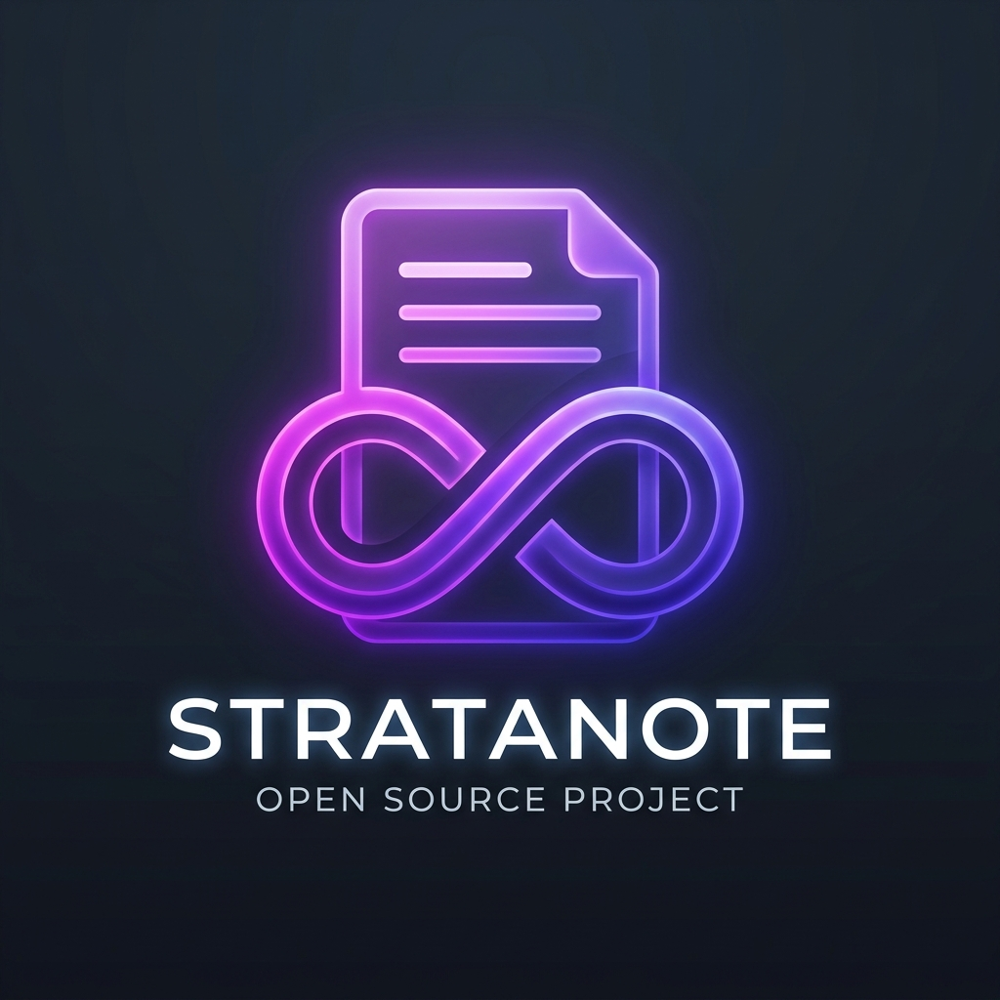

# StrataNote

🌐 [English](README.md) | [Русский](README.ru.md)

<p align="center">
  
</p>

**StrataNote** is a modern collaborative Markdown knowledge base and note-taking web application. The project combines the visual experience of classic Obsidian (bidirectional wiki-links, interactive graph view, folders and files) with real-time multi-user editing, version control (revisions), and administration features.

---

## 📁 Project Structure

*   `_app/` — main web application directory:
    *   `client/` — frontend client part (React + TypeScript + Vite + CodeMirror 6)
    *   `server/` — backend server part (Node.js + Express + Socket.io + SQLite + Chokidar)
    *   `scripts/` — utility and deployment scripts (startup, testing, releases)
*   `_sync_mcp/` — local Model Context Protocol (MCP) sync agent (Node.js + WebSockets):
    *   Allows editing files locally (in Obsidian / VS Code) with automatic or manual background synchronization with the server.
*   `start.bat` — quick startup batch script for Windows (starts the application with a single click).
*   `.agents/` — configuration and rules for AI coding assistants (Antigravity/Claude/Gemini).

Personal notes and media assets (`assets/`) are excluded from the Git repository by default (configured in `.gitignore`).

---

## 🛠 Requirements

To run this project, you will need:
*   [Node.js](https://nodejs.org/) (version LTS 20+ recommended)
*   Git installed on your system

---

## 🚀 Setup and Run

### Step 1. Clone the Repository
```bash
git clone https://github.com/cannoneer85-svg/stratanote.git
cd stratanote
```

### Step 2. Install Dependencies
Navigate to the `_app` folder and run the package installation script:
```bash
cd _app
npm run install:all
```
This script will automatically install all required packages for the root monorepo, client (`client/`), server (`server/`), and local sync agent (`_sync_mcp/`).

### Step 3. Start the Application

You can choose one of three startup modes:

#### A. Quick Windows Launch (Recommended)
Simply run the `start.bat` file in the root directory of the repository. The script will:
1. Automatically find a free local port (starting from 3001).
2. Compile frontend client assets (if build folder is missing).
3. Start the backend server.
4. Open the application in your default web browser at `http://localhost:<port>`.

#### B. Start Production Build (Manually)
1. Build the frontend client assets from the `_app` folder:
   ```bash
   npm run build
   ```
2. Start the server:
   ```bash
   npm start
   ```
3. Open in your browser: **http://localhost:3001**

#### C. Development Mode (with Hot Reloading)
To make changes to the code in real-time, start the dev server from the `_app` folder:
1. Run the dev command:
   ```bash
   npm run dev
   ```
   *Frontend Vite server will start on port `5173`, and the API server will run on port `3001` (requests will be automatically proxied).*
2. Open in your browser: **http://localhost:5173**

---

## 🧪 Testing

To run integration media tests, run the following command from the `_app` folder (ensure the server is running on port 3001):
```bash
npm run test:media
```

To run mobile UI layout E2E tests:
```bash
npm run test:mobile
```

---

## ⚙ Environment Variables

You can configure the server behavior using environment variables (or by creating a `.env` file in the `_app/server/` folder):
*   `PORT` — port on which the backend server starts (default is `3001`).
*   `VAULT_PATH` — path to the notes vault directory that the application should serve. Default is the parent directory of `_app` (repository root).
*   `DATABASE_PATH` — absolute path to the SQLite database file. Default is `_app/server/database.sqlite`. In production environments, point this variable to a mounted persistent volume (e.g. `/data/database.sqlite`) to prevent data loss on container restarts.

---

## ☁ Production Deployment

In production environments (e.g., Railway, Render, Fly.io), containers are ephemeral by default. To preserve user database entries and uploaded media assets, you must attach a persistent volume.

### Example Configuration for Railway:
1.  **Configure Build Path**: In your Railway service settings (**Settings**), set or change the **Root Directory** field to `_app`. This tells Railway to compile and run the project from the application subfolder.
2.  **Attach a Persistent Volume**:
    *   Create a new **Volume** (e.g., `stratanote-volume` with size of 5 GB) in your Railway project panel.
    *   Mount it to the application service at the mount path: `/data`.
3.  **Configure Environment Variables**:
    Add the following variables in the **Variables** tab:
    *   `DATABASE_PATH` = `/data/database.sqlite` (redirects the DB to the persistent volume).
    *   `VAULT_PATH` = `/data/vault` (redirects the notes vault folder to the persistent volume).
4.  **Automatic Partitioning**: Once mounted, the backend server will automatically initialize the database on the persistent volume and safely store your notes and images in `/data/vault/assets/` between deployments.
