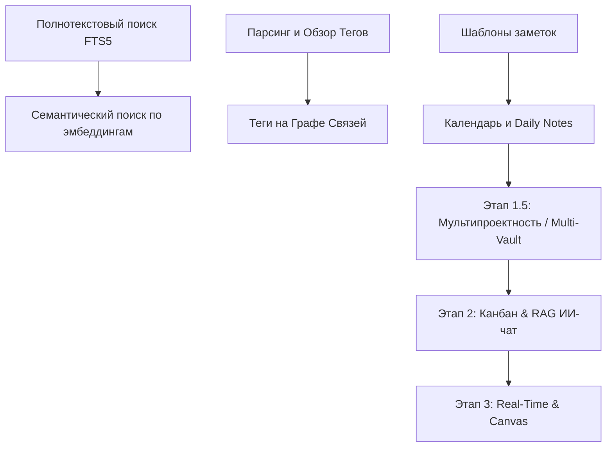
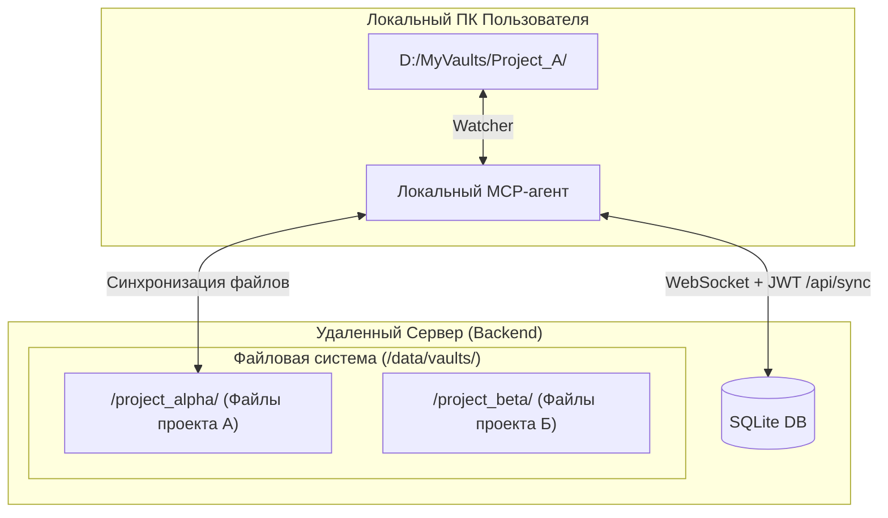

# Анализ функционала StrataNote и дорожная карта развития (Roadmap)

В данном документе представлен детальный анализ текущих возможностей системы **StrataNote**, её сравнение с лидерами рынка (Obsidian, Notion) и предложена структурированная дорожная карта развития, включая концепцию множественных изолированных хранилищ (Multi-Vault / Projects).

---

## 1. Сравнительный анализ: StrataNote vs. Obsidian vs. Notion

| Функционал / Критерий | StrataNote (Текущий) | Obsidian | Notion |
| :--- | :--- | :--- | :--- |
| **Формат данных** | Открытый Markdown (`.md`) на диске | Открытый Markdown (`.md`) на диске | Проприетарный (облачная БД) |
| **Локальная работа** | **Да** (через MCP-агент синхронизации) | **Да** (основной режим) | **Нет** (ограниченный оффлайн) |
| **Совместная работа (Multiplayer)** | **Да** (Блокировки + Suggest Mode / Рецензирование) | **Нет** (только через платный Sync или Git) | **Да** (Real-time редактирование в стиле Google Docs) |
| **История версий** | **Да** (SQLite БД, DiffViewer на клиенте) | **Да** (File Recovery плагин / Git) | **Да** (облачный бэкап) |
| **Интерактивный граф** | **Да** (Вики-ссылки + Семантические связи ИИ) | **Да** (только физические вики-ссылки) | **Нет** |
| **Встроенный ИИ** | **Да** (локальные эмбеддинги для связей) | **Нет** (только через плагины) | **Да** (облачный Notion AI) |
| **Управление задачами** | **Да** (простые списки задач Markdown) | **Да** (плагины Kanban, Tasks) | **Да** (мощные базы данных) |
| **Поиск по базе знаний** | **Нет** (только проводник файлов) | **Да** (быстрый полнотекстовый поиск) | **Да** (быстрый Quick Find) |
| **Мультипроектность / Несколько хранилищ** | **Нет** (один общий Vault) | **Да** (концепция независимых Vaults) | **Да** (независимые Workspaces / Страницы) |

### Сильные стороны StrataNote, которые нужно развивать:
1. **Гибридная модель (Local-first + Real-time Backend)**: Пользователь хранит файлы локально и редактирует их в любимом Obsidian/VSCode, но при этом имеет веб-портал для совместной работы команды с контролей версий и Suggest-режимом.
2. **Локальный ИИ из коробки**: Использование `Xenova/paraphrase-multilingual` для выстраивания логических связей без отправки данных на внешние сервера (конфиденциальность корпоративных баз знаний).

---

## 2. Чего критически не хватает (Точки роста)

1. **Полнотекстовый и семантический поиск**: База знаний быстро становится бесполезной, если в ней нельзя быстро найти нужный абзац или концепт по ключевым словам.
2. **Классификация (Теги)**: Отсутствие поддержки хэштегов (`#tag`) ограничивает возможности структурирования информации без жесткой привязки к иерархии папок.
3. **Изоляция проектов (Multi-Vault / Multi-Project)**: Для командной работы (например, в агентствах) критически важно иметь возможность разделять разные проекты по отдельным изолированным хранилищам с гибким разграничением прав доступа, чтобы пользователи видели только назначенные им проекты.
4. **Интерактивный таск-трекинг (Канбан)**: Совместная работа над проектами всегда тесно связана с задачами. Простых чек-листов в Markdown недостаточно для визуализации процессов.
5. **Контекстный ИИ-ассистент (RAG Chat)**: Раз уж в системе уже считаются векторные эмбеддинги для графа, логичным развитием является создание чата, который отвечает на вопросы по всей базе знаний.
6. **Настоящий real-time мультиплеер**: Блокировки файлов предотвращают конфликты, но совместное редактирование "в четыре руки" (как в Google Docs/Notion) значительно повысило бы UX.

---

## 3. Дорожная карта развития StrataNote (Roadmap)

Доработки разделены на 4 этапа на основе баланса **Ценность / Сложность**. Проекты-хранилища выделены в отдельный этап, так как это фундаментальное архитектурное изменение бэкенда.

### Этап 1: Быстрые победы и критический функционал (Must-Have)
*Фокус на базовом удобстве поиска, навигации и структурирования.*

*   **[x] Полнотекстовый (FTS5) и семантический ИИ-поиск** — **РЕАЛИЗОВАНО**. Интегрирован поиск по тексту на базе SQLite FTS5 со сниппетами и по смыслу с использованием ИИ-эмбеддингов (Xenova). Создано модальное окно `SearchModal` (вызов по `Ctrl+P` / `Ctrl+K` или кнопке в сайдбаре).
*   **Поддержка тегов (Tags Explorer) и интеграция с графом** (Сложность: Низкая-Средняя, Целесообразность: 9/10)
*   **Шаблоны заметок (Templates)** (Сложность: Низкая, Целесообразность: 8/10)
*   **Календарь и Ежедневные заметки (Daily Notes)** (Сложность: Низкая, Целесообразность: 7/10)

---

### Этап 1.5: Мультипроектность и изоляция данных (Архитектурный фундамент)
*Внедрение концепции независимых проектов/хранилищ (Vaults) с разграничением прав доступа.*

#### Реализация мультипроектности (Multi-Vault)
*   **Описание**: Переход от единого монолитного хранилища к системе изолированных проектов (Vaults). Администратор в панели настроек может создавать проекты и назначать список пользователей, имеющих к ним доступ. При входе в систему (после авторизации) пользователь видит дашборд со списком доступных ему проектов (аналогично Jira или Slack Workspaces). При переходе в проект вся сессия (файловый менеджер, редактор, граф, поиск) изолируется в рамках этого проекта.

*   **Как это работает на удаленном сервере**:
    1.  **Хранение файлов**: Все файлы проектов хранятся в изолированных папках внутри общего каталога хранилища (например, `/data/vaults/project_1/`, `/data/vaults/project_2/`).
    2.  **Схема базы данных**: В БД SQLite добавляется таблица `projects` (ID, название, описание, создатель, дата создания) и связующая таблица `project_users` (ID проекта, ID пользователя, роль в рамках проекта). Во все основные таблицы (`notes`, `versions`, `locks`, `suggestions`, `comments`, `note_embeddings`) добавляется колонка `project_id` для логического разделения записей.
    3.  **API и Маршрутизация**: Все API-запросы дополняются идентификатором проекта. Например, получение списка файлов идет через `GET /api/projects/:projectId/notes`, а сокет-соединения разделяются по комнатам (Rooms) Socket.io на основе `project_id`, чтобы автоблокировки и онлайн-статусы рассылались только участникам конкретного проекта.
    4.  **Файловый наблюдатель (Watcher)**: Chokidar на сервере инициализируется динамически для папки каждого активного проекта, либо один глобальный инстанс распределяет события в зависимости от пути к файлу.

*   **Как это работает локально (с MCP-агентом синхронизации)**:
    1.  В конфигурационном файле локального агента `config.json` прописывается не только API-токен, но и `project_id`, а также локальный путь к папке этого проекта на жестком диске (например, `D:/Obsidian/Agency/ProjectA`).
    2.  Локальный агент подключается к серверу, передавая `project_id` при авторизации. Синхронизация (Push/Pull) происходит строго между этой локальной папкой и изолированной папкой проекта на сервере.
    3.  Пользователь может запускать несколько локальных агентов для разных проектов (на разных портах) или один агент с поддержкой мульти-конфигурации.

*   **Целесообразность/Необходимость**: **Критически высокая (10/10)**. Для командной, агентской или корпоративной работы это базовая необходимость. Без разделения проектов система превращается в одну большую свалку файлов, где невозможно ограничить доступ к конфиденциальным данным клиентов.
*   **Сложность**: **Высокая (7/10)**. Потребуется переработка структуры БД, миграции существующих данных в дефолтный проект, изменение путей API, добавление экрана выбора проекта во фронтенд и доработка логики MCP-агента.
*   **Приоритет**: **Высокий**. Эту фичу необходимо внедрить как можно раньше, поскольку она затрагивает ядро бэкенда. Делать её после реализации канбан-досок или совместного редактирования будет в разы сложнее из-за накопившегося легаси-кода.

---

### Этап 2: Интерактивность и ИИ-ассистирование (Should-Have)
*Фокус на внедрении ИИ и визуального управления задачами.*

*   **Интерактивные Канбан-доски (Kanban Boards)** (Сложность: Высокая, Целесообразность: 9/10)
*   **Локальный RAG ИИ-чат (Умный помощник по базе знаний)** (Сложность: Средняя-Высокая, Целесообразность: 9/10)
*   **Экспорт в PDF / HTML** (Сложность: Средняя, Целесообразность: 6/10)

---

### Этап 3: Премиум-архитектура и масштабирование (Could-Have)
*Сложные долгосрочные задачи для крупных распределенных команд.*

*   **Настоящее совместное редактирование в реальном времени (Y.js / Automerge)** (Сложность: Очень высокая, Целесообразность: 8/10)
*   **Интерактивный бесконечный холст (StrataNote Canvas)** (Сложность: Высокая, Целесообразность: 6/10)
*   **Ролевая модель на уровне папок (Folder-level RBAC)** (Сложность: Высокая, Целесообразность: 8/10).

---

## 4. Сводная оценка доработок

| Фича | Этап | Необходимость / Целесообразность (1-10) | Сложность реализации (1-10) | Приоритет |
| :--- | :---: | :---: | :---: | :---: |
| **[x] Полнотекстовый и семантический поиск** | 1 | **10 / 10** (Критическая) | **5 / 10** (Средняя) | **ВЫПОЛНЕНО** |
| **Поддержка тегов (сайдбар + граф)** | 1 | **9 / 10** (Высокая) | **4 / 10** (Низкая-Ср) | **Высокий** |
| **Шаблоны заметок (Templates)** | 1 | **8 / 10** (Высокая) | **2 / 10** (Низкая) | **Высокий** |
| **Календарь и Ежедневные заметки** | 1 | **7 / 10** (Средняя) | **2 / 10** (Низкая) | **Средний** |
| **Мультипроектность (Multi-Vault)** | **1.5** | **10 / 10** (Критическая) | **7 / 10** (Высокая) | **Высокий** |
| **Интерактивный Канбан-доск** | 2 | **9 / 10** (Высокая) | **7 / 10** (Высокая) | **Средний** |
| **Локальный RAG ИИ-чат** | 2 | **9 / 10** (Высокая) | **6 / 10** (Средняя) | **Средний** |
| **Экспорт в PDF / HTML** | 2 | **6 / 10** (Средняя) | **5 / 10** (Средняя) | **Низкий** |
| **Real-time совместное редактирование** | 3 | **8 / 10** (Высокая) | **9 / 10** (Очень выс) | **Низкий** |
| **Бесконечный холст (Canvas)** | 3 | **6 / 10** (Средняя) | **8 / 10** (Высокая) | **Низкий** |
| **Разграничение прав на уровне папок** | 3 | **8 / 10** (Высокая) | **7 / 10** (Высокая) | **Низкий** |

> [!NOTE]
> Внедрение **Мультипроектности (Multi-Vault)** на этапе **1.5** заложит надежный фундамент для коммерческого использования StrataNote. Это позволит безопасно хранить файлы разных клиентов в изолированных папках на удаленном сервере и синхронизировать их с соответствующими локальными директориями сотрудников.
